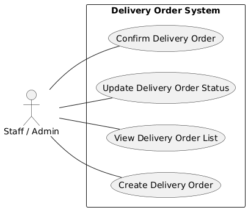
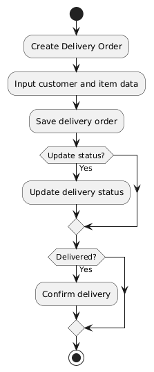

# Delivery Order System

## Project Description
This project is a **Delivery Order System** developed as part of an academic project.  
The system is designed to manage the delivery process of goods, starting from delivery order creation until delivery status updates and confirmation.

## Project Scope
The scope of this system includes:
- Create delivery orders
- View delivery order list
- Update delivery order status
- Delivery confirmation

This project does not include sales order processing, payment, accounting, or advanced logistics features.

## Development Methodology
This project uses **Agile methodology**.  
The system is developed incrementally to allow flexibility, continuous improvement, and better progress tracking throughout the development process.

## System Design

### Use Case Diagram
Below is the use case diagram illustrating system interaction:

### Activity Diagram
Below is the activity diagram showing the workflow of the delivery order process:

## Team Members
- **Alfarid Ridwan** – Project Manager / Developer  
- **Susi** – Developer  

## Tools and Technologies
- Git & GitHub (version control and collaboration)
- Programming language / framework: to be determined

## Project Status
Status: **In Progress**

The project is currently in the design and early development phases.  
Progress is tracked through GitHub commits and regular updates.

## Repository Contents
This repository contains:
- Project documentation
- System design diagrams
- Source code of the Delivery Order System
